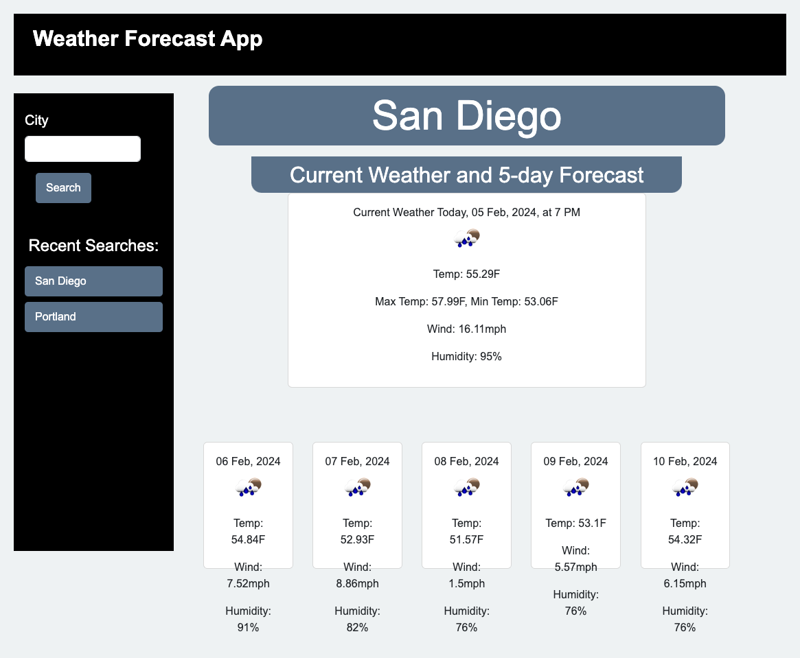

# Weather Dashboard - README

## Project Overview

Welcome to the Weather Dashboard! Our application provides you with a fully functional weather dashboard that runs in your browser, offering dynamically updated HTML and CSS to help you access real-time weather information for multiple cities. We've successfully leveraged third-party APIs, specifically the [5 Day Weather Forecast API](https://openweathermap.org/forecast5), to retrieve weather data for cities worldwide.

## Key Features

- **Real-Time Weather Data**: With our Weather Dashboard, you can instantly access current and future weather conditions for your selected cities, making trip planning a breeze.

- **Persistent Search History**: We've implemented a smart search history feature that stores your previous city searches using `localStorage`, so you never lose track of your destinations.

- **User-Friendly Interface**: The intuitive and visually appealing user interface ensures a seamless experience while checking the weather for your favorite cities.

## How to Use

1. Start by entering the name of the city you want to check the weather for in the provided form.

2. Once you initiate the search, you'll be presented with up-to-the-minute weather conditions for your chosen city.

3. Your city search will be automatically saved in the search history for quick access in the future.

4. When you view the current weather conditions for a city, you'll find detailed information such as the city name, date, weather conditions icon, temperature, humidity, and wind speed.

5. Explore the future weather conditions for the city in an easy-to-read 5-day forecast format, including the date, weather conditions icon, temperature, wind speed, and humidity.

6. To revisit the weather conditions for any previously searched city, simply click on that city in the search history.

## User Story

Imagine you're a traveler with the power to effortlessly check the weather outlook for multiple cities. Our Weather Dashboard makes it possible for you to plan your trips with confidence, knowing exactly what the weather has in store for your destinations.

##alt text Mock-Up


### Links

[Deployed Site](https://catxcoding.github.io/weather-dashboard)

[Repository](https://github.com/catxcoding/weather-dashboard)

### Resources Used

```
* Xpert Leaning Assistant
* Office Hours before/after class
* Starter Code via Mitchell Hudson Youtube
* Reference Code from https://openweathermap.org/forecast5
* W3Schools
* MDN
```
